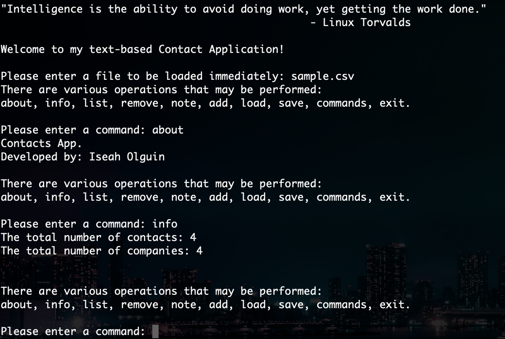
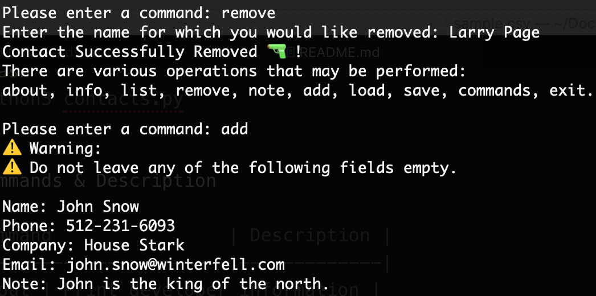
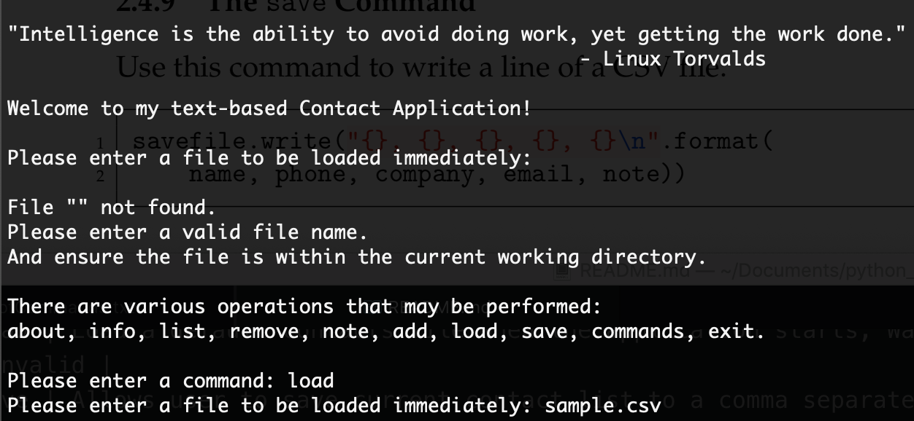
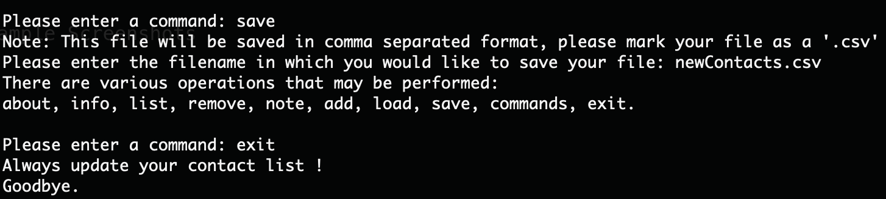
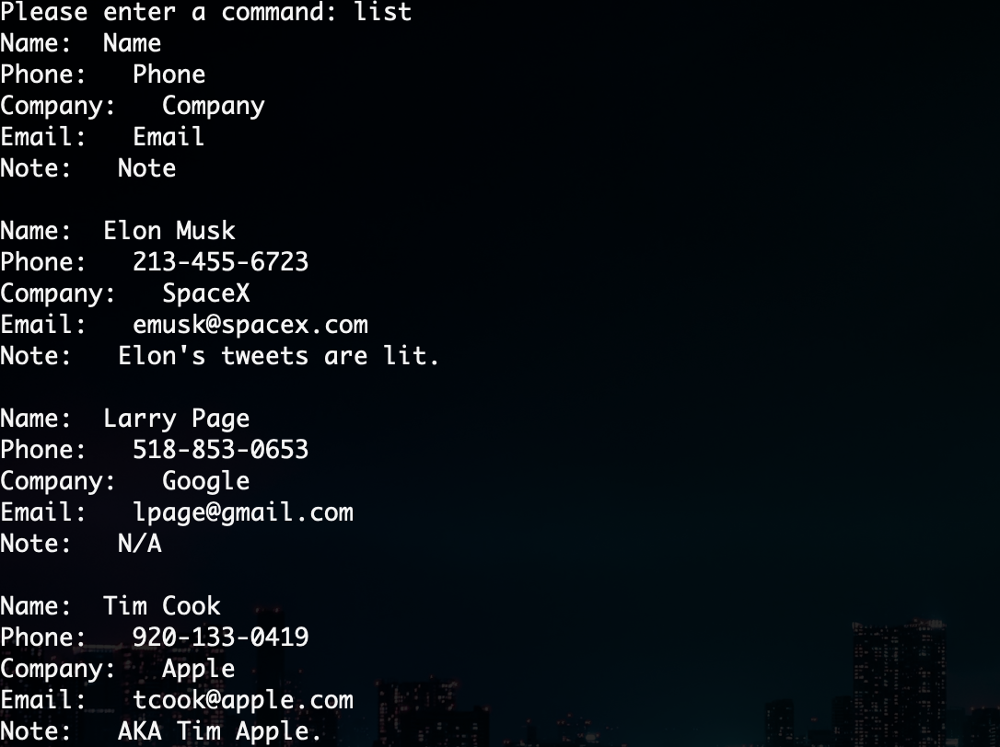

# contactManagement

# About

This is a text-based business contact application.
It is very agile and a clear solution for various businesses to store their contact lists.

# Quickstart

Clone the repository:

```bash

```
Run in Terminal:

```bash
$ python3 contacts.py
```

# Commands & Description

| Command                | Description |
|------------------------|-------------|
| about | Print developer information. |
| info | Print number of contacts, and companies. |
| list | List all contacts. |
| remove | Remove a contact. Report contacts updated, Warns user if trying to remove contact that does not exist. |
| note | Allows user to edit a note associated with a specified contact, or to view the current note. |
| add | Add a contact. |
| load | Load a default contacts file when the application starts, Warns user if file is invalid. |
| save | Allows user to save current contact list to a comma separated file (CSV). |
| commands | Load a set of commands from a file and execute them. |

# Example Screenshots

<div align="center">
    
    
    
    
    
</div>

# Command Feature Specifics

⚫️ Total number of contacts

⚫️ Number of companies

    ✨ Assumes each contact works at a different company.

⚫️ List all contacts

⚫️ Remove a contact

    ✨ To properly remove a contact: user must enter full name

    ✨ i.e. 'Elon Musk' rather than 'Elon'

⚫️ Add a contact

    ✨ To properly add a contact: user must enter something for each field.

    ✨ Will return to main instructions if user leaves a field empty.

    ✨ Furthermore, phone number must be ten digits long.

        ✨ i.e. 505-321-6920

⚫️ Create a note associated with specified contact

⚫️ Load a default contacts file:

    ✨ From startup: Immediately asks to load a file.

    ✨ Ensure this file is within your current working directory.

    ✨ However, the file titled 'sample.csv' is a great start to immediately load a simple contact list.

⚫️ Load a set of commands from a file

    ✨ MUST follow the example file: 'listofCommands.txt'.

    ✨ One instruction per line.

    ✨ Just as the normal program executes, each input is required immediately after the keyword is seen.

⚫️ Save contacts to a CSV file

    ✨ Must enter the '.csv' file extension when naming file, however file will be in the comma separated format.


| Extra Credit           | Implemented |
|------------------------|-------------|
| Random Welcome & Goodbye |     ✔    |
| Validate User Input | ✔ |
| Import Contacts from a CSV file | ✔ |
| Use Object Oriented Programming | ✔ |

# Last Update:

04/29/19

# Code Style

Formatted using [Black](https://github.com/ambv/black). Linted using [PyLint](https://www.pylint.org/).
